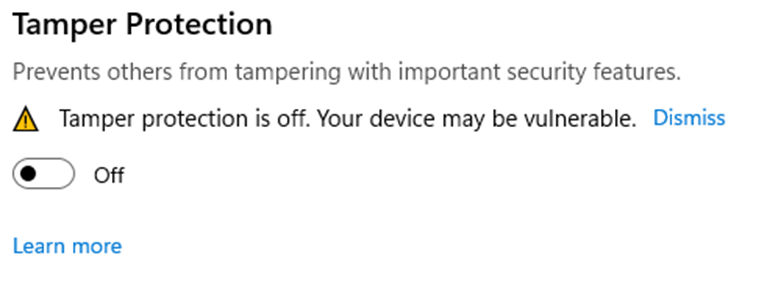
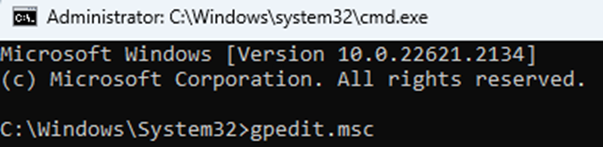
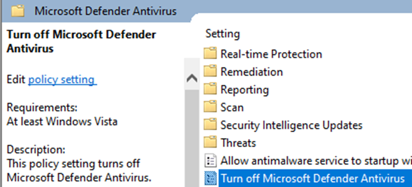
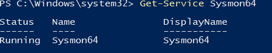
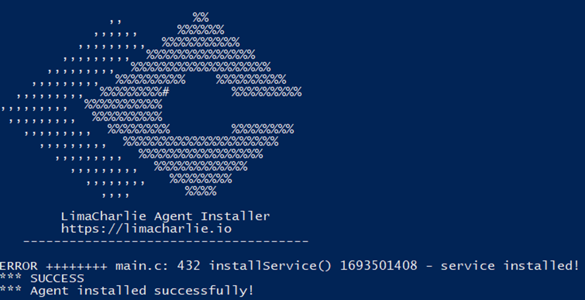
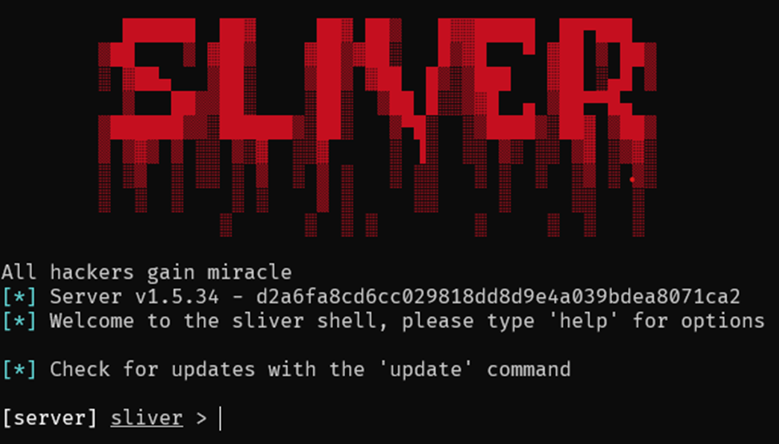
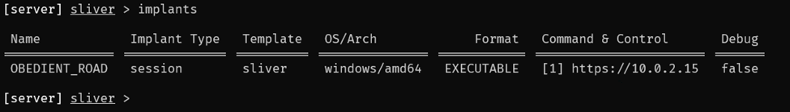
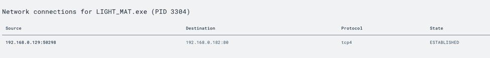
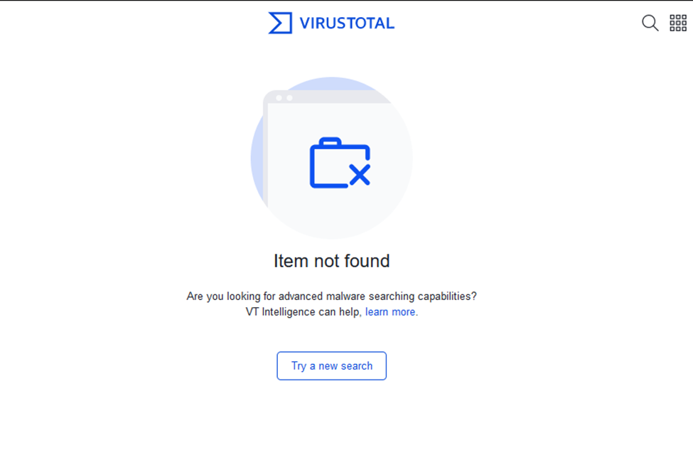

# SOC LimaCharlie Sliver Lab
Credit goes to Eric Capuano for writing ["So you want to be a SOC Analyst?"](https://blog.ecapuano.com/p/so-you-want-to-be-a-soc-analyst-intro) and putting together this lab!
### Summary

### Learning Objectives
- Configure and deploy Virtual Machines
- Hands-on experience with EDR (Endpoint Detection and Response) and C2s (Command and Control)
- 
### Tools & Requirements
- VirtualBox or VMWare
- Windows VM
- Linux VM
- Sysmon
- LimaCharlie
- Sliver

## Step 1: Set up a Windows/Linux Server VM
1. Install VirtualBox
2. Download and deploy a [Windows VM](https://developer.microsoft.com/en-us/windows/downloads/virtual-machines/)
3. Download and deploy a [Linux Server VM](https://releases.ubuntu.com/22.04.1/ubuntu-22.04.1-live-server-amd64.iso).

## Step 2: Disabling Windows Defender
1. Disable Tamper Protection

2. Disable Defender via Group Policy Editor 
 

## Step 3: Installing Sysmon (Windows VM)
1. Download and install Sysmon to provide granular telemtry on Windows Endpoints.
2. Download and install [SwiftOnSecurity](https://infosec.exchange/@SwiftOnSecurity) Sysmon config
3. Validate Symon is running

## Step 4: Installing LimaCharlie (Windows VM)
1. Create a LimaCharlie account
2. Install LimaCharlie on the Windows VM
  
3. Add a rule to allow LimaCharlie to recieve the Sysmon event table

## Step 5: Installing/Creating a payload with Sliver C2 (Linux VM)
1. Download and and install Sliver
2. Create a directory for sliver: /opt/sliver
3. Generate a C2 session payload using sliver in /opt/sliver by running ``sliver``

4. Confirm the new implant configuration

## Step 6: Python Server
1. Start a python server with the command ``python3 -m http.server 80`` to transfer over the payload generated by Sliver to the Windows VM

## Step 7: Start a Command and Control Session
1. Start an Sliver HTTP listener by running the commands ``sliver-server`` and ``http`` while in Sliver
2. Execute the C2 payload on the Windows VM

## Step 8: Observe the EDR(LimaCharlie) Telemetry
1. Conduct hash analysis using VirusTotal

This virus did not show up in VirusTotal because VT has never seen the file! Eric Capuano states "This actually makes a file even more suspicious because nearly everything has been seen by VirusTotal".

